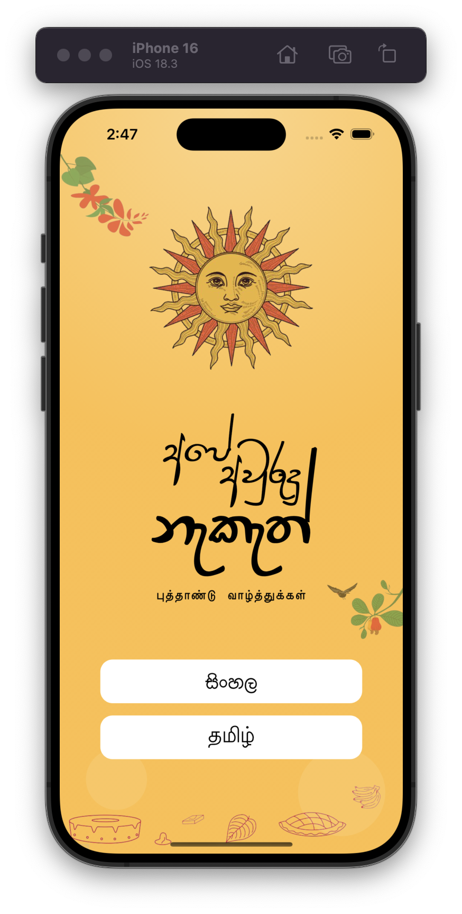
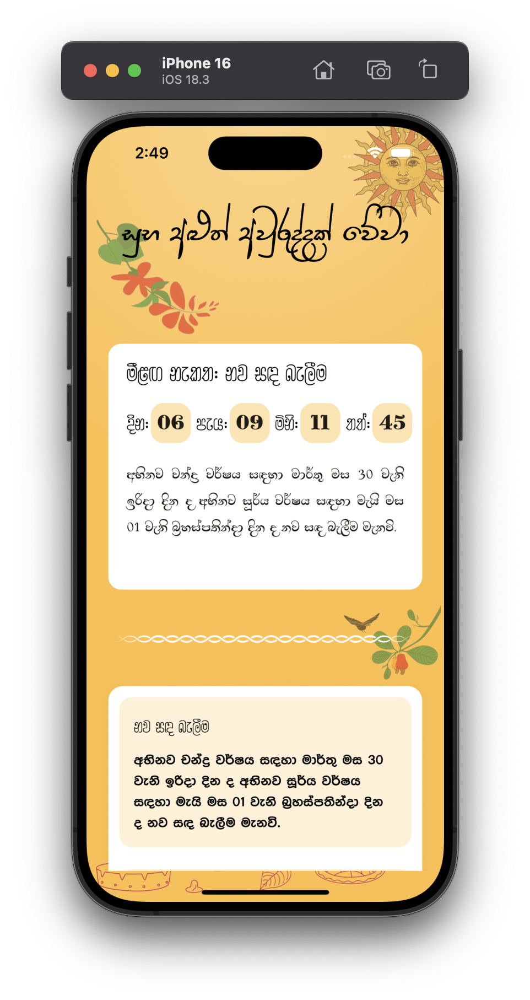
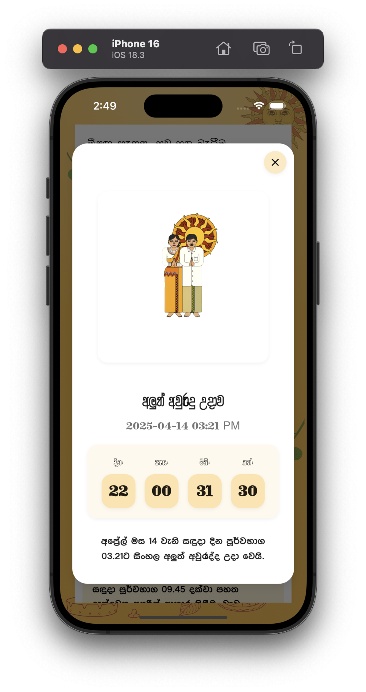

# Avurudu Nakath App

A Flutter application that helps users track and manage important dates and events related to the Sinhala and Tamil New Year (Avurudu) celebrations.

Download from Google Play Store: [Avurudu Nakath 2025](https://play.google.com/store/apps/details?id=com.aurudu.app)

## About

Welcome to the ultimate guide for celebrating the Sinhala and Tamil New Year in 2025! This app is designed to help you embrace the rich traditions and customs of Avurudu with ease and joy. Whether you're preparing for the festivities or looking to deepen your understanding of this cultural celebration, this app has everything you need.

## Features

- Get started with a user-friendly onboarding experience
- View important dates and events for Avurudu celebrations
- Detailed information about each event
- Modern and intuitive user interface
- Easy navigation between different sections
- Precise details of the Nakath times for 2025
- Information about auspicious times including:
  - Dawn of the New Year
  - Lighting the hearth
  - Starting work

## Screenshots

### Get Started Page


### Home Page


### Detailed Information Page


## Getting Started

### Prerequisites

- Flutter SDK (latest version)
- Dart SDK (latest version)
- Android Studio / VS Code
- Android SDK / Xcode (for iOS development)

### Installation

1. Clone the repository:
```bash
git clone https://github.com/chamudithaperera/Flutter-Dart-project-06-Avurudu-Nakath-App.git
```

2. Navigate to the project directory:
```bash
cd Flutter-Dart-project-06-Avurudu-Nakath-App
```

3. Install dependencies:
```bash
flutter pub get
```

4. Run the app:
```bash
flutter run
```

## Technologies Used

- Flutter
- Dart
- Material Design

## Data Safety

- No data shared with third parties
- No data collected

## Contributing

Contributions are welcome! Please feel free to submit a Pull Request.

## License

This project is licensed under the MIT License - see the LICENSE file for details.

## Author

- Chamuditha Perera
- GitHub: [@chamudithaperera](https://github.com/chamudithaperera)
- Email: chamudithaperera.dev@gmail.com

## Support

For any support or queries, please contact:
- Email: chamudithaperera.dev@gmail.com

## Acknowledgments

- Flutter team for the amazing framework
- All contributors who have helped in the development of this app